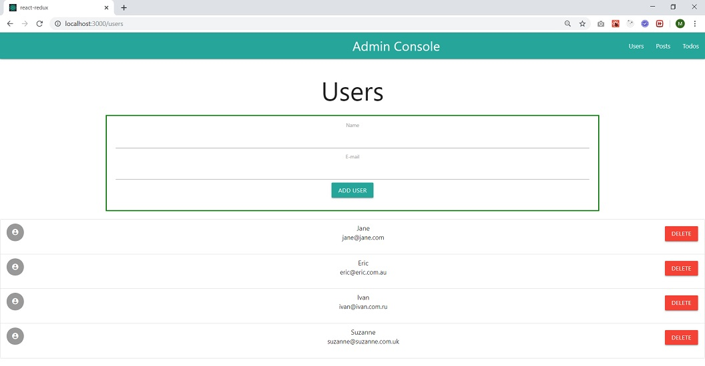
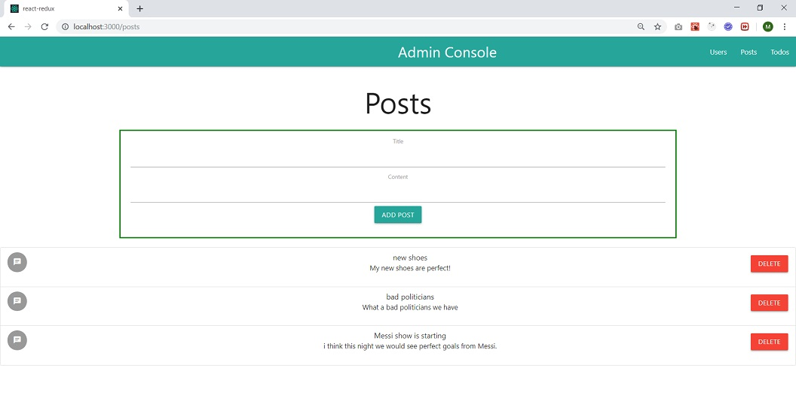
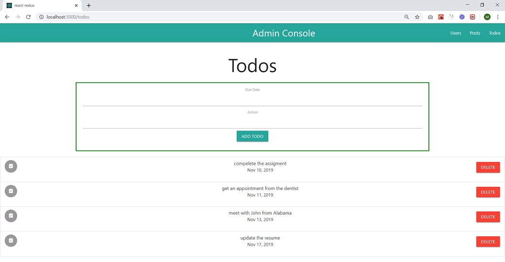

In this React project we are using Redux in detail with generating an admin console. All components use/update data at one storage point with Redux. All component actions and reducers controls data separately. Materialize CSS also used for the GUI design.







You can run projects with below commands:

```javascript
yarn start
```
or 
```javascript
npm start
```